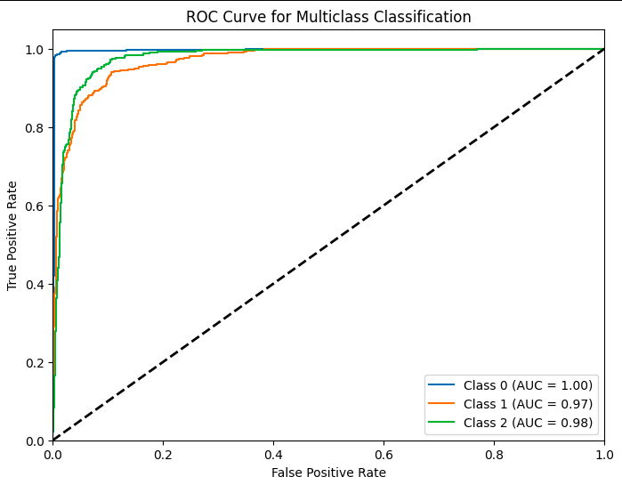

# NASA Exoplanet Prediction System​

Machine learning-powered project developed for the NASA Space Apps Challenge. The project leverages AI to analyze astronomical data and identify potential exoplanets—planets outside our solar system. By processing datasets from NASA’s Kepler mission and other space observatories, the model predicts which stars are likely to host exoplanets based on features such as orbital period, transit depth, stellar properties, and more.

This project implements a complete ML pipeline for exoplanet classification, featuring:
- Data preprocessing and feature engineering
- Multiple model training and evaluation
- Hyperparameter optimization
- FastAPI backend with batch prediction capabilities
- React frontend for interactive predictions

## Purpose:

Aid in the discovery of new exoplanets using AI.

Provide an accessible platform for both researchers and space enthusiasts to analyze exoplanet data.

Demonstrate the power of machine learning in real-world space exploration problems.

## Key Highlights:

Uses a supervised learning AI model trained on NASA Kepler datasets.

Interactive frontend with data visualization of exoplanet candidates.

Easily deployable backend for real-time prediction queries.

# Problem Statement: A World Away: Hunting for Exoplanets with AI
The discovery of exoplanets—planets orbiting stars outside our solar system—is a critical step in understanding the universe and the potential for life beyond Earth. However, analyzing the massive amounts of astronomical data collected by missions like NASA's Kepler and TESS is time-consuming and prone to human error.

Traditional methods of exoplanet detection require manual inspection of light curves and complex statistical analysis, making it difficult to quickly identify promising candidates. There is a need for an automated, accurate, and scalable solution to sift through large datasets, detect potential exoplanets, and prioritize them for further observation.

# Solution Overview

AI provides an automated solution to detect potential exoplanets using machine learning. The project follows a structured data-driven approach to analyze stellar data and generate accurate predictions.

## 1. Data Source
The model uses the Kepler Object of Interest (KOI) dataset provided by NASA, which contains information on star observations, transit features, and confirmed exoplanets.
Link: 
https://exoplanetarchive.ipac.caltech.edu/cgi-bin/TblView/nph-tblView?app=ExoTbls&config=cumulative

The dataset includes features such as orbital period, transit duration, transit depth, stellar effective temperature, stellar radius, and various flags indicating data quality

## 2. Data Analysis & Preprocessing
### 1. Exploratory Data Analysis (EDA)

Explored the KOI dataset to understand the structure, feature distributions, and relationships with the target variable (koi_disposition).

Identified missing values and outliers in features such as koi_prad, koi_teq, and koi_srad.

Visualized correlations between key features and the target to determine which features are most predictive of exoplanet presence.

### 2. Data Cleaning

Removed rows with inconsistent or missing critical data that could affect model accuracy.

Handled remaining null values using imputation techniques for numerical features or exclusion when appropriate.

Ensured the dataset was clean and ready for modeling, without corrupt or misleading entries.

### 3. Feature Selection

Selected features most relevant to predicting exoplanets, including:
koi_period, koi_duration, koi_depth, koi_prad, koi_teq, koi_insol, koi_model_snr, koi_steff, koi_slogg, koi_srad, koi_kepmag, and the false-positive flags.

Dropped redundant or non-informative columns to improve model efficiency and reduce noise.

Focused on features with high correlation to the target while maintaining data integrity.

| Feature           | Description                                                                              |
| ----------------- | ---------------------------------------------------------------------------------------- |
| `koi_period`      | Orbital period of the planet candidate (days)                                            |
| `koi_duration`    | Duration of the transit (hours)                                                          |
| `koi_depth`       | Depth of the transit (ppm)                                                               |
| `koi_prad`        | Planetary radius (Earth radii)                                                           |
| `koi_teq`         | Equilibrium temperature of the planet (K)                                                |
| `koi_insol`       | Insolation flux (Earth flux units)                                                       |
| `koi_model_snr`   | Signal-to-noise ratio of the transit model                                               |
| `koi_fpflag_nt`   | Not transit-like flag (indicates non-transit events)                                     |
| `koi_fpflag_ss`   | Stellar eclipse flag (indicates eclipsing binary)                                        |
| `koi_fpflag_co`   | Centroid offset flag (indicates false positive due to background star)                   |
| `koi_fpflag_ec`   | Ephemeris match contamination flag (indicates contamination from known eclipsing binary) |
| `koi_steff`       | Stellar effective temperature (Kelvin)                                                   |
| `koi_slogg`       | Stellar surface gravity (log(g) in cgs)                                                  |
| `koi_srad`        | Stellar radius (Solar radii)                                                             |
| `koi_kepmag`      | Kepler magnitude of the host star                                                        |
| `koi_disposition` | Target label: `CONFIRMED`, `FALSE POSITIVE`, or `CANDIDATE`                              |

### 4. Preprocessing

Normalized numerical features such as koi_prad, koi_teq, and koi_insol for consistent scale across the dataset.

applied Log tarnsformation for skewed features

Split the cleaned dataset into training and testing sets to evaluate model performance reliably.

### Outcome:
This structured approach ensured that the dataset was accurate, clean, and feature-rich, enabling the AI model to learn effectively and predict exoplanet candidates with high accuracy

## 3. Model training
1. Model Selection

Tested multiple supervised learning algorithms or ensemble learning techniques including:

Random Forest, XGBoost, Gradient Boosting e.t.c

Selected the model with the best balance of accuracy and interpretability.

Raw Data → Feature Selection → Data Cleaning → Imputation → Log Transformation → 
 Standard Scaling → Model Training

 ### Key Features Used

    Orbital Parameters: koi_period, koi_duration, koi_depth

    Physical Properties: koi_prad, koi_teq, koi_insol

    Stellar Characteristics: koi_steff, koi_slogg, koi_srad

    Quality Flags: koi_fpflag_nt, koi_fpflag_ss, koi_fpflag_co, koi_fpflag_ec

    Signal Quality: koi_model_snr, koi_kepmag

Target Variable: koi_disposition (FALSE POSITIVE, CANDIDATE, CONFIRMED)

execute individual components 
#### Data ingestion
    python src/components/data_ingestion.py

#### Data transformation
    python src/components/data_transformation.py

#### Model training
    python src/components/model_trainer.py

python src/components/model_trainer.py

Run the complete training process

    python src/pipelines/training_pipeline.py

### 2. Training Process

Split the cleaned dataset into training (80%) and testing (20%) sets.

Normalized and encoded features to ensure compatibility with the chosen model.

Applied cross-validation to optimize hyperparameters and prevent overfitting.

Trained the model on the training set, learning to predict the presence of exoplanets (koi_disposition).

### 3. Hyperparameter Tuning

Used Grid Search / Random Search to identify the optimal values for parameters like:

Number of trees (n_estimators) in Random Forest

Maximum tree depth (max_depth)

Learning rate (learning_rate) for XGBoost

Ensured the model generalized well to unseen data.

## 📊 Model Performance Comparison
| Model               | Accuracy  | Precision | Recall   | F1-Score | Best Parameters                          |
|--------------------|-----------|-----------|---------|----------|-----------------------------------------|
| XGBoost            | 92.79%    | 90.32%    | 90.32%  | 90.31%   | learning_rate=0.1, max_depth=5, n_estimators=200 |
| Random Forest      | 92.52%    | 90.18%    | 89.77%  | 89.96%   | max_depth=20, max_features=sqrt, n_estimators=200 |
| Decision Tree      | 90.90%    | 88.31%    | 87.08%  | -        | -                                       |
| AdaBoost           | 90.49%    | 87.32%    | 87.11%  | -        | -                                       |
| Logistic Regression| 89.44%    | 86.04%    | 85.40%  | 85.60%   | C=10.0, solver=liblinear                |

### ROC Curve

### Future Work / Improvements

While the current version of ExoPlanet AI provides accurate predictions for exoplanet candidates, there are several opportunities to enhance the project further:

1. Integrate Additional Datasets

Include data from NASA’s TESS mission or other exoplanet surveys to improve model accuracy and generalization.

2. Real-Time Data Ingestion

Develop pipelines to automatically fetch new astronomical data from NASA APIs, enabling continuous learning and up-to-date predictions.

3. Enhanced Feature Engineering

Explore additional stellar and planetary features, derived metrics, or time-series analysis of light curves to boost prediction performance.

4. Automated Model Evaluation & Explainability

Incorporate SHAP or LIME to explain model predictions and increase trust in AI-driven exoplanet detection.

5. Deployment Enhancements

Containerize the application (Docker) for easier deployment and scalability.

Enable cloud hosting with free-tier services (e.g., Render, Vercel) for a live, always-available demo.

## 🚀 Quick Setup & Installation
### Prerequisites

    Python 3.8 or higher

    pip package manager

    Git

### Create Virual enviornment

    conda create -n nasa-exoplanet python=3.11 -y
    conda activate nasa-exoplanet

### Install Dependencies

    pip install -r requirements.txt

### Start the Backend Server
Development mode (auto-reload)

    uvicorn app:app --reload --host 0.0.0.0 --port 8000

Production mode

    uvicorn app:app --host 0.0.0.0 --port 8000

### Frontend:
    # Navigate to frontend directory
    cd frontend

    # Install dependencies
    npm install

    # Start development server
    npm start

    # Build for production
    npm run build